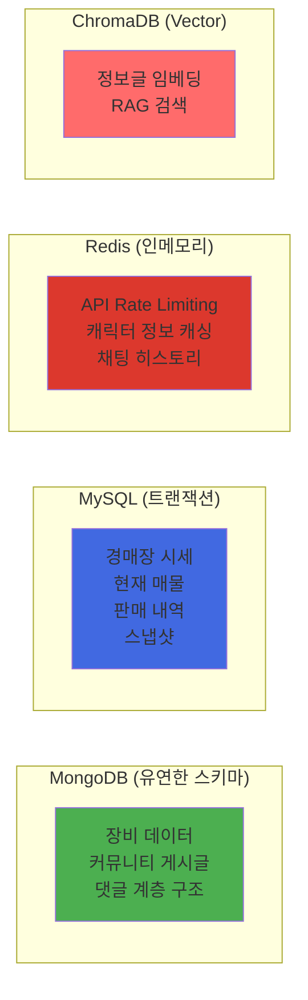
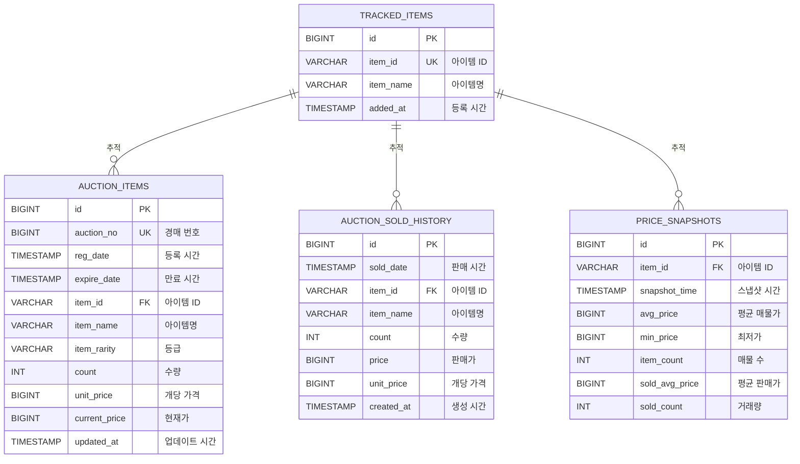
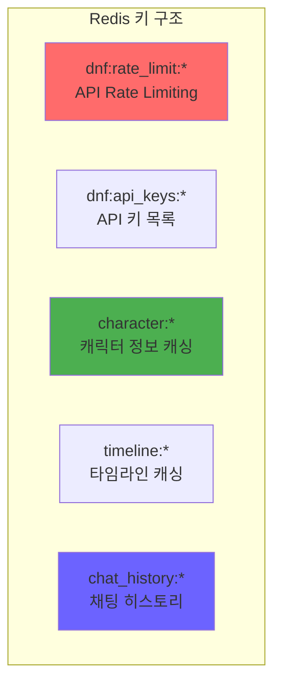
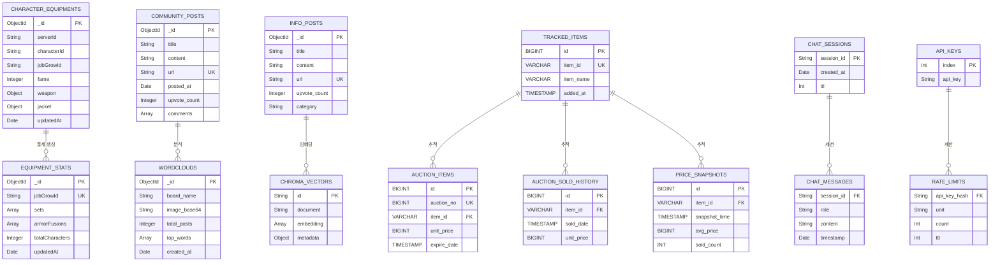

# 데이터베이스 설계 문서 (DATABASE_DESIGN.md)

## 목차
1. [데이터베이스 개요](#데이터베이스-개요)
2. [MongoDB 스키마](#mongodb-스키마)
3. [MySQL 스키마](#mysql-스키마)
4. [Redis 키 구조](#redis-키-구조)
5. [ChromaDB Vector DB](#chromadb-vector-db)
6. [E-R 다이어그램](#e-r-다이어그램)
7. [인덱스 및 성능 최적화](#인덱스-및-성능-최적화)

---

## 데이터베이스 개요

### 사용 데이터베이스

| 데이터베이스 | 버전 | 용도 | 포트 |
|-------------|------|------|------|
| **MongoDB** | 7.0 | 캐릭터 장비, 커뮤니티 게시글, 정보글, 워드클라우드 | 27017 |
| **MySQL** | 8.0 | 경매장 시세 (현재 매물, 판매 내역, 스냅샷) | 3307 (→3306) |
| **Redis** | 7 | API 키 Rate Limiting, 캐릭터 정보 캐싱, 채팅 히스토리 | 6379 |
| **ChromaDB** | Latest | Vector 임베딩 (RAG 검색용 정보글) | 로컬 파일 시스템 |

### 데이터베이스 선택 이유



---

## MongoDB 스키마

### 연결 정보
```yaml
Host: mongodb:27017
Database: dnf_insight
Auth: admin / password123 (authSource=admin)
```

### 1. character_equipments (캐릭터 장비 스냅샷)

**용도**: 캐릭터별 장비 정보 저장 (직업별 통계 분석용)

**스키마**:
```javascript
{
  _id: ObjectId,
  serverId: String,           // 서버 ID (예: "cain")
  characterId: String,        // 캐릭터 ID (네오플 API)
  characterName: String,      // 캐릭터 닉네임
  jobId: String,              // 직업 ID
  jobGrowId: String,          // 각성 직업 ID
  jobName: String,            // 직업명
  jobGrowName: String,        // 각성 직업명
  fame: Integer,              // 명성

  // 장비 슬롯 (13개)
  weapon: {
    itemId: String,
    itemName: String,
    itemTypeDetail: String,   // 무기 종류
    tuneName: String,          // 무기 튠 (옵션)
    tuneTag: String            // 무기 튠 태그 (예: "힘+12")
  },
  title: {
    itemId: String,
    itemName: String
  },
  jacket: {                   // 상의
    itemId: String,
    itemName: String,
    setItemName: String,      // 세트명
    fusionStone: String       // 융합석
  },
  headShoulder: { ... },      // 머리어깨
  pants: { ... },             // 하의
  shoes: { ... },             // 신발
  belt: { ... },              // 벨트
  necklace: { ... },          // 목걸이
  bracelet: { ... },          // 팔찌
  ring: { ... },              // 반지
  subEquipment: { ... },      // 보조장비
  magicStone: { ... },        // 마법석
  earring: { ... },           // 귀걸이

  // 스킬 스타일 (VP 스킬)
  skillStyle: {
    style: {
      grow: String,           // 진화/강화 구분
      skills: [
        {
          skillId: String,
          name: String,
          level: Integer
        }
      ]
    },
    tags: [String]            // 세트/칭호/무기 튠 태그
  },

  updatedAt: Date             // 마지막 업데이트 시간
}
```

**인덱스**:
```javascript
db.character_equipments.createIndex(
  { serverId: 1, characterId: 1 },
  { unique: true, name: "character_idx" }
);

db.character_equipments.createIndex(
  { jobGrowId: 1 },
  { name: "idx_job_grow" }
);
```

**샘플 데이터**:
```json
{
  "serverId": "cain",
  "characterId": "cb87f16da8475750d45ac9ea60ccab39",
  "characterName": "EADG",
  "jobGrowId": "37495b941da3b1661bc900e68ef3b2c6",
  "jobGrowName": "眞 웨펀마스터",
  "fame": 72500,
  "weapon": {
    "itemId": "weapon123",
    "itemName": "천계의 검",
    "tuneName": "힘+12"
  },
  "jacket": {
    "setItemName": "군신의 위엄 세트",
    "fusionStone": "힘 융합석"
  }
}
```

---

### 2. community_posts (커뮤니티 게시글)

**용도**: 디시인사이드 dfip 갤러리, 아카라이브 dunfa 채널 크롤링 데이터

**스키마**:
```javascript
{
  _id: ObjectId,
  title: String,              // 제목
  content: String,            // 본문 (원본 HTML 포함)
  author: String,             // 작성자
  url: String,                // URL (unique)

  posted_at: Date,            // 작성 시간 (KST → Fake UTC 저장)
  crawled_at: Date,           // 크롤링 시간 (KST → Fake UTC)
  crawl_session_id: String,   // 크롤링 세션 ID (예: "20251202_140000")

  board_name: String,         // 게시판명 ("디시인사이드 dfip" or "아카라이브 dunfa")
  view_count: Integer,        // 조회수
  comment_count: Integer,     // 댓글 수
  upvote_count: Integer,      // 추천수 (RAG 가중치용)

  comments: [                 // 댓글 계층 구조
    {
      comment_id: String,     // 댓글 ID (사이트 제공)
      parent_id: String,      // 부모 댓글 ID (대댓글인 경우)
      depth: Integer,         // 깊이 (0=원댓글, 1=대댓글)
      author: String,
      content: String,        // 댓글 내용 (원본)
      posted_at: Date,
      replies: [              // 자식 댓글 리스트 (재귀 구조)
        { ... }
      ]
    }
  ]
}
```

**인덱스**:
```javascript
db.community_posts.createIndex(
  { url: 1 },
  { unique: true, name: "idx_url" }
);

db.community_posts.createIndex(
  { crawled_at: -1 },
  { name: "idx_crawled_at" }
);

db.community_posts.createIndex(
  { board_name: 1, posted_at: -1 },
  { name: "idx_board_posted" }
);

db.community_posts.createIndex(
  { upvote_count: -1 },
  { name: "idx_upvote" }
);
```

**샘플 데이터**:
```json
{
  "title": "무기마 빌드 추천",
  "content": "무기마 하려고 하는데...",
  "author": "user123",
  "url": "https://arca.live/b/dunfa/123456",
  "posted_at": "2025-12-15T10:00:00+09:00",
  "crawled_at": "2025-12-15T11:30:00+09:00",
  "board_name": "아카라이브 dunfa",
  "upvote_count": 42,
  "comment_count": 15,
  "comments": [
    {
      "comment_id": "c_797444581",
      "parent_id": null,
      "depth": 0,
      "author": "댓글작성자",
      "content": "군신 세트 추천",
      "replies": [
        {
          "comment_id": "c_797444582",
          "parent_id": "c_797444581",
          "depth": 1,
          "author": "대댓글작성자",
          "content": "군신이 제일 좋음"
        }
      ]
    }
  ]
}
```

---

### 3. info_posts (정보글 전용)

**용도**: 디시인사이드 📚정보 말머리 게시글 (Vector DB RAG 전용)

**스키마**:
```javascript
{
  _id: ObjectId,
  title: String,              // 제목
  content: String,            // 본문 (원본)
  author: String,             // 작성자
  url: String,                // URL (unique)

  posted_at: Date,            // 작성 시간
  crawled_at: Date,           // 크롤링 시간
  crawl_session_id: String,   // 크롤링 세션 ID

  view_count: Integer,        // 조회수
  upvote_count: Integer,      // 추천수 (Vector 가중치용)
  comment_count: Integer,     // 댓글 수

  gallery_id: String,         // 갤러리 ID (기본: "dfip")
  category: String            // 말머리 (기본: "📚정보")
}
```

**인덱스**:
```javascript
db.info_posts.createIndex(
  { url: 1 },
  { unique: true, name: "idx_url" }
);

db.info_posts.createIndex(
  { upvote_count: -1 },
  { name: "idx_upvote" }
);

db.info_posts.createIndex(
  { crawl_session_id: 1 },
  { name: "idx_session" }
);
```

---

### 4. wordclouds (워드클라우드 이미지)

**용도**: 생성된 워드클라우드 이미지 및 통계 저장

**스키마**:
```javascript
{
  _id: ObjectId,
  board_name: String,         // "아카라이브 dunfa" or "디시인사이드 dfip"
  image_base64: String,       // Base64 인코딩된 이미지
  image_format: String,       // "png"

  // 통계
  total_posts: Integer,       // 분석한 게시글 수
  total_words: Integer,       // 추출된 단어 수
  unique_words: Integer,      // 중복 제거 후 단어 수
  top_words: [                // 상위 100개 단어
    {
      word: String,
      count: Integer
    }
  ],

  created_at: Date,           // 생성 시간
  params: {                   // 생성 파라미터
    max_words: Integer,       // 최대 단어 수
    width: Integer,           // 이미지 너비
    height: Integer,          // 이미지 높이
    min_font_size: Integer,
    max_font_size: Integer
  }
}
```

**인덱스**:
```javascript
db.wordclouds.createIndex(
  { board_name: 1, created_at: -1 },
  { name: "idx_board_created" }
);
```

---

### 5. equipment_stats (장비 통계)

**용도**: 직업별 장비 통계 (세트, 융합석, VP 스킬 조합)

**스키마**:
```javascript
{
  _id: ObjectId,
  jobGrowId: String,          // 각성 직업 ID
  jobGrowName: String,        // 각성 직업명

  // 세트 통계
  sets: [
    {
      setName: String,        // 세트명 (정규화: "군신의 위엄")
      count: Integer,         // 사용 캐릭터 수
      percentage: Float       // 비율 (0~100)
    }
  ],

  // 방어구 융합석 통계
  armorFusions: [ ... ],

  // 무기 융합석 통계
  weaponFusions: [ ... ],

  // 악세서리 융합석 통계
  accessoryFusions: [ ... ],

  // VP 스킬 조합 통계
  skillStyles: [
    {
      grow: String,           // "진화" or "강화"
      skillNames: [String],   // 스킬명 리스트
      tags: [String],         // 세트/칭호/무기 튠 태그
      count: Integer,
      percentage: Float
    }
  ],

  totalCharacters: Integer,   // 분석한 캐릭터 수
  updatedAt: Date             // 마지막 업데이트
}
```

**인덱스**:
```javascript
db.equipment_stats.createIndex(
  { jobGrowId: 1 },
  { unique: true, name: "idx_job_grow" }
);
```

---

## MySQL 스키마

### 연결 정보
```yaml
Host: mysql:3306
Database: dnf_auction
User: dnf / password123
Charset: utf8mb4
Collation: utf8mb4_unicode_ci
Timezone: Asia/Seoul (JDBC)
```

### E-R 다이어그램 (MySQL)



---

### 1. tracked_items (추적 대상 아이템)

**용도**: 경매장에서 추적할 아이템 목록

**테이블 정의**:
```sql
CREATE TABLE tracked_items (
    id BIGINT PRIMARY KEY AUTO_INCREMENT,

    -- 필수 입력 필드
    item_id VARCHAR(32) UNIQUE NOT NULL COMMENT '아이템 ID',
    item_name VARCHAR(100) NOT NULL COMMENT '아이템명',

    -- 자동 생성 필드
    added_at TIMESTAMP DEFAULT CURRENT_TIMESTAMP COMMENT '등록 시간',

    INDEX idx_item_id (item_id)
) ENGINE=InnoDB DEFAULT CHARSET=utf8mb4 COLLATE=utf8mb4_unicode_ci
COMMENT '추적 대상 아이템';
```

**샘플 데이터**:
```sql
INSERT INTO tracked_items (item_id, item_name) VALUES
('36beb5ca88540128e075aa5a647d2e1b', '시간의 균열 결정'),
('c1e2f3a4b5c6d7e8f9a0b1c2d3e4f5a6', '마법 봉인 해제제');
```

---

### 2. auction_items (현재 경매 매물)

**용도**: 네오플 API에서 수집한 현재 경매 매물 (1분마다 갱신)

**테이블 정의**:
```sql
CREATE TABLE auction_items (
    id BIGINT PRIMARY KEY AUTO_INCREMENT,

    auction_no BIGINT UNIQUE NOT NULL COMMENT '경매 번호',
    reg_date TIMESTAMP NOT NULL COMMENT '등록 시간',
    expire_date TIMESTAMP NOT NULL COMMENT '만료 시간',

    item_id VARCHAR(32) NOT NULL COMMENT '아이템 ID',
    item_name VARCHAR(100) NOT NULL COMMENT '아이템명',
    item_rarity VARCHAR(20) COMMENT '등급',

    count INT NOT NULL COMMENT '수량',
    reg_count INT COMMENT '등록 수량',
    current_price BIGINT COMMENT '현재가',
    unit_price BIGINT COMMENT '개당 가격',
    average_price BIGINT COMMENT '평균 시세',

    created_at TIMESTAMP DEFAULT CURRENT_TIMESTAMP,
    updated_at TIMESTAMP DEFAULT CURRENT_TIMESTAMP ON UPDATE CURRENT_TIMESTAMP,

    INDEX idx_item_id (item_id),
    INDEX idx_unit_price (unit_price),
    INDEX idx_reg_date (reg_date)
) ENGINE=InnoDB DEFAULT CHARSET=utf8mb4 COLLATE=utf8mb4_unicode_ci
COMMENT '현재 경매 매물';
```

**샘플 데이터**:
```sql
INSERT INTO auction_items (
    auction_no, reg_date, expire_date,
    item_id, item_name, item_rarity,
    count, unit_price, current_price
) VALUES (
    1234567890,
    '2025-12-15 10:00:00',
    '2025-12-16 10:00:00',
    '36beb5ca88540128e075aa5a647d2e1b',
    '시간의 균열 결정',
    'LEGENDARY',
    10,
    50000000,
    500000000
);
```

---

### 3. auction_sold_history (판매 완료 내역)

**용도**: 판매 완료된 경매 내역 (최근 100건 수집)

**테이블 정의**:
```sql
CREATE TABLE auction_sold_history (
    id BIGINT PRIMARY KEY AUTO_INCREMENT,

    sold_date TIMESTAMP NOT NULL COMMENT '판매 시간',

    item_id VARCHAR(32) NOT NULL COMMENT '아이템 ID',
    item_name VARCHAR(100) NOT NULL COMMENT '아이템명',
    item_rarity VARCHAR(20) COMMENT '등급',

    count INT NOT NULL COMMENT '수량',
    price BIGINT NOT NULL COMMENT '판매가',
    unit_price BIGINT NOT NULL COMMENT '개당 가격',

    created_at TIMESTAMP DEFAULT CURRENT_TIMESTAMP,

    INDEX idx_item_id (item_id),
    INDEX idx_sold_date (sold_date),
    INDEX idx_item_sold (item_id, sold_date)
) ENGINE=InnoDB DEFAULT CHARSET=utf8mb4 COLLATE=utf8mb4_unicode_ci
COMMENT '판매 완료 내역';
```

**중복 체크 로직** (Java):
```java
// soldDate ±5초 범위에서 같은 아이템 + 같은 가격이 있으면 중복으로 간주
boolean exists = soldHistoryRepo.findByItemIdAndSoldDateBetween(
    itemId,
    soldDate.minusSeconds(5),
    soldDate.plusSeconds(5)
).stream().anyMatch(h -> h.getPrice().equals(price));
```

---

### 4. price_snapshots (시세 스냅샷)

**용도**: 1분 간격으로 생성되는 시세 스냅샷 (차트용)

**테이블 정의**:
```sql
CREATE TABLE price_snapshots (
    id BIGINT PRIMARY KEY AUTO_INCREMENT,

    item_id VARCHAR(32) NOT NULL COMMENT '아이템 ID',
    item_name VARCHAR(100) NOT NULL COMMENT '아이템명',
    snapshot_time TIMESTAMP NOT NULL COMMENT '스냅샷 시간',

    -- 현재 매물 통계
    avg_price BIGINT COMMENT '평균 매물가 (가중평균)',
    min_price BIGINT COMMENT '최저가',
    item_count INT DEFAULT 0 COMMENT '등록 물량',

    -- 거래 통계 (최근 1분)
    sold_avg_price BIGINT COMMENT '평균 판매가',
    sold_max_price BIGINT COMMENT '최고 판매가',
    sold_count INT DEFAULT 0 COMMENT '거래 건수',

    UNIQUE KEY uk_item_snapshot (item_id, snapshot_time),
    INDEX idx_item_time (item_id, snapshot_time),
    INDEX idx_snapshot_time (snapshot_time)
) ENGINE=InnoDB DEFAULT CHARSET=utf8mb4 COLLATE=utf8mb4_unicode_ci
COMMENT '시세 스냅샷';
```

**스냅샷 재계산 쿼리** (Spring Data JPA):
```java
// 과거 10분치 스냅샷 조회
List<PriceSnapshot> pastSnapshots = priceSnapshotRepo.findByItemIdAndSnapshotTimeBetween(
    itemId, tenMinutesAgo, now
);

// 각 스냅샷마다 soldDate 기준으로 거래 통계 재계산
Double soldAvgPrice = soldHistoryRepo.getAveragePriceBetween(itemId, intervalStart, snapshotTime);
Long soldMaxPrice = soldHistoryRepo.getMaxPriceBetween(itemId, intervalStart, snapshotTime);
Long soldCount = soldHistoryRepo.sumSoldCountBetween(itemId, intervalStart, snapshotTime);
```

---

## Redis 키 구조

### 연결 정보
```yaml
Host: redis:6379
Password: (없음)
Database: 0 (기본)
```

### 키 네임스페이스



---

### 1. API Rate Limiting (dnf:rate_limit:*)

**용도**: Redis Sliding Window 방식 Rate Limiting

**키 구조**:
```
dnf:rate_limit:{apiKeyHash}:second  → Integer (1초 카운트)
dnf:rate_limit:{apiKeyHash}:minute  → Integer (1분 카운트)
dnf:rate_limit:{apiKeyHash}:hour    → Integer (1시간 카운트)
```

**TTL**:
- `second`: 1초 (자동 만료)
- `minute`: 60초
- `hour`: 3600초

**예시**:
```redis
SET dnf:rate_limit:1234567:second 150 EX 1
SET dnf:rate_limit:1234567:minute 5000 EX 60
SET dnf:rate_limit:1234567:hour 80000 EX 3600
```

**Java 코드**:
```java
String redisKey = RATE_LIMIT_PREFIX + keyHash + ":" + unit;

// 현재 카운트 조회
Long currentCount = redisTemplate.opsForValue().get(redisKey);

// 한도 초과 체크
if (currentCount >= maxRequests) {
    return false;
}

// 카운트 증가
Long newCount = redisTemplate.opsForValue().increment(redisKey);

// 첫 요청이면 TTL 설정
if (newCount == 1) {
    redisTemplate.expire(redisKey, Duration.ofSeconds(ttlSeconds));
}
```

---

### 2. API 키 목록 (dnf:api_keys:*)

**용도**: 다중 API 키 저장

**키 구조**:
```
dnf:api_keys:0  → "PSmv35du3EfiXNEtzf2Gdy4P9yba2tSJ"
dnf:api_keys:1  → "3v70cQoFmRHByQ57lUlrvOleakSoVhqg"
dnf:api_keys:2  → "9QLL8xNgcmwcVBnKlVPFmzRa9uN2MFTU"
```

**초기화** (Spring Boot @PostConstruct):
```java
@PostConstruct
public void initApiKeys() {
    List<String> apiKeys = dnfApiConfig.getKeys();
    for (int i = 0; i < apiKeys.size(); i++) {
        String key = API_KEY_PREFIX + i;
        redisTemplate.opsForValue().set(key, apiKeys.get(i));
    }
}
```

---

### 3. 캐릭터 정보 캐싱 (character:*)

**용도**: 캐릭터 검색 결과 캐싱 (5분 TTL)

**키 구조**:
```
character:{serverId}:{characterName}  → JSON (캐릭터 검색 결과)
```

**TTL**: 300초 (5분)

**예시**:
```redis
SET character:cain:EADG '{"characterId":"cb87f...", "characterName":"EADG", ...}' EX 300
```

---

### 4. 타임라인 캐싱 (timeline:*)

**용도**: 타임라인 분석 결과 캐싱 (5분 TTL)

**키 구조**:
```
timeline:{serverId}:{characterId}  → JSON (타임라인 데이터)
```

**TTL**: 300초 (5분)

---

### 5. 채팅 히스토리 (chat_history:*)

**용도**: LLM 채팅 세션별 히스토리 (Redis List)

**키 구조**:
```
chat_history:{session_id}  → List<JSON> (최대 50개 메시지)
```

**TTL**: 86400초 (24시간)

**데이터 구조**:
```json
[
  {
    "role": "user",
    "content": "무기마 빌드 추천해줘",
    "timestamp": "2025-12-15T10:00:00+09:00"
  },
  {
    "role": "assistant",
    "content": "군신 세트를 추천합니다...",
    "timestamp": "2025-12-15T10:00:15+09:00"
  }
]
```

**Python 코드** (FastAPI):
```python
# 메시지 추가
await redis_client.rpush(key, json.dumps(message, ensure_ascii=False))

# TTL 설정
await redis_client.expire(key, 86400)

# 최대 50개 유지
list_len = await redis_client.llen(key)
if list_len > 50:
    await redis_client.ltrim(key, list_len - 50, -1)

# 조회
messages_json = await redis_client.lrange(key, 0, -1)
messages = [json.loads(msg) for msg in messages_json]
```

---

## ChromaDB Vector DB

### 저장 위치
```bash
/app/chroma_db  # Docker 컨테이너 내부
./crawler/chroma_data  # 호스트 마운트 경로
```

### Collection 구조

**Collection Name**: `dnf_info_posts`

**메타데이터**:
```json
{
  "description": "던파 정보 게시글 (추천수 가중치)"
}
```

**Document 구조**:
```python
{
  "id": "3562510",  # URL에서 추출한 게시글 번호
  "document": "11월 27일 이벤트 설명\n\n던파 이벤트 이미지와 함께 보는 간단 설명입니다...",  # 제목 + 본문
  "embedding": [0.123, -0.456, ...],  # 768차원 벡터 (Ko-Sroberta)
  "metadata": {
    "title": "11월 27일 이벤트 설명",
    "url": "https://gall.dcinside.com/mgallery/board/view/?id=dfip&no=3562510",
    "author": "작성자명",
    "posted_at": "2024-11-27T10:30:00",
    "upvote_count": 41,
    "view_count": 12143,
    "comment_count": 5,
    "gallery_id": "dfip",
    "category": "📚정보",
    "crawl_session_id": "20241127_103000"
  }
}
```

**임베딩 모델**:
- **모델명**: `jhgan/ko-sroberta-multitask`
- **차원**: 768
- **언어**: 한국어 특화
- **프레임워크**: SentenceTransformers

**검색 쿼리**:
```python
# 의미적 검색 (추천수 가중치)
results = vector_db_service.search(
    query="무기마 빌드 추천",
    top_k=5,
    min_upvote=10,
    boost_by_upvote=True
)

# 결과 구조
[
  {
    "id": "3562510",
    "document": "...",
    "metadata": { ... },
    "distance": 0.35,  # L2 distance (낮을수록 유사)
    "similarity": 0.74,  # 0~1 사이 변환
    "boosted_score": 0.88  # 추천수 가중치 적용
  }
]
```

**추천수 가중치 공식**:
```python
upvote_boost = 1 + math.log10(upvote_count + 1) * 0.2
boosted_score = similarity * upvote_boost

# 예시:
# 추천수 0   → 가중치 1.0
# 추천수 10  → 가중치 1.2 (20% 부스트)
# 추천수 100 → 가중치 1.4 (40% 부스트)
# 추천수 1000 → 가중치 1.6 (60% 부스트)
```

---

## E-R 다이어그램

### 전체 데이터베이스 관계도



---

## 인덱스 및 성능 최적화

### MongoDB 인덱스

#### 1. character_equipments
```javascript
// 복합 Unique 인덱스
db.character_equipments.createIndex(
  { serverId: 1, characterId: 1 },
  { unique: true, name: "character_idx" }
);

// 직업 조회용
db.character_equipments.createIndex(
  { jobGrowId: 1 },
  { name: "idx_job_grow" }
);

// 업데이트 시간 정렬
db.character_equipments.createIndex(
  { updatedAt: -1 },
  { name: "idx_updated_at" }
);
```

#### 2. community_posts
```javascript
// URL 중복 방지
db.community_posts.createIndex(
  { url: 1 },
  { unique: true, name: "idx_url" }
);

// 최근 게시글 조회
db.community_posts.createIndex(
  { crawled_at: -1 },
  { name: "idx_crawled_at" }
);

// 게시판별 정렬
db.community_posts.createIndex(
  { board_name: 1, posted_at: -1 },
  { name: "idx_board_posted" }
);

// 추천수 정렬
db.community_posts.createIndex(
  { upvote_count: -1 },
  { name: "idx_upvote" }
);
```

#### 3. info_posts
```javascript
// URL 중복 방지
db.info_posts.createIndex(
  { url: 1 },
  { unique: true, name: "idx_url" }
);

// 추천수 정렬 (RAG 가중치)
db.info_posts.createIndex(
  { upvote_count: -1 },
  { name: "idx_upvote" }
);

// 크롤링 세션별 조회
db.info_posts.createIndex(
  { crawl_session_id: 1 },
  { name: "idx_session" }
);
```

---

### MySQL 인덱스

#### 1. auction_items
```sql
-- 경매 번호 Unique
CREATE UNIQUE INDEX uk_auction_no ON auction_items (auction_no);

-- 아이템별 조회
CREATE INDEX idx_item_id ON auction_items (item_id);

-- 가격 정렬
CREATE INDEX idx_unit_price ON auction_items (unit_price);

-- 등록 시간 정렬
CREATE INDEX idx_reg_date ON auction_items (reg_date);
```

#### 2. auction_sold_history
```sql
-- 아이템별 조회
CREATE INDEX idx_item_id ON auction_sold_history (item_id);

-- 판매 시간 정렬
CREATE INDEX idx_sold_date ON auction_sold_history (sold_date);

-- 복합 인덱스 (스냅샷 재계산용)
CREATE INDEX idx_item_sold ON auction_sold_history (item_id, sold_date);
```

#### 3. price_snapshots
```sql
-- 중복 방지
CREATE UNIQUE INDEX uk_item_snapshot ON price_snapshots (item_id, snapshot_time);

-- 차트 조회용 (item_id + 시간 범위)
CREATE INDEX idx_item_time ON price_snapshots (item_id, snapshot_time);

-- 시간별 조회
CREATE INDEX idx_snapshot_time ON price_snapshots (snapshot_time);
```

---

### 쿼리 최적화 전략

#### 1. 커버링 인덱스 (MySQL)
```sql
-- 스냅샷 조회 시 인덱스만으로 데이터 반환
EXPLAIN SELECT item_id, snapshot_time, avg_price, sold_count
FROM price_snapshots
WHERE item_id = '36beb5ca88540128e075aa5a647d2e1b'
  AND snapshot_time BETWEEN '2025-12-15 10:00:00' AND '2025-12-15 11:00:00'
ORDER BY snapshot_time ASC;

-- 결과: Using index (커버링 인덱스)
```

#### 2. 복합 인덱스 활용 (MongoDB)
```javascript
// 게시판별 + 추천수 정렬
db.community_posts.find({
  board_name: "아카라이브 dunfa",
  upvote_count: { $gte: 10 }
}).sort({ posted_at: -1 }).limit(100);

// 인덱스: { board_name: 1, posted_at: -1 } 활용
```

#### 3. 캐싱 레이어 (Redis)
- **캐릭터 검색**: 5분 캐싱 → API 호출 감소
- **타임라인**: 5분 캐싱 → next 토큰 처리 비용 절감

#### 4. 배치 처리
- **임베딩 생성**: batch_size=32 (GPU 메모리 효율)
- **MongoDB upsert**: 배치 삽입 (중복 체크)

---

### 데이터 정리 전략

#### 1. MySQL 자동 정리
```java
// 10분마다 만료된 매물 삭제
@Scheduled(fixedDelay = 600000)
public void cleanExpiredItems() {
    LocalDateTime now = LocalDateTime.now();
    List<AuctionItem> expiredItems = auctionItemRepo.findAll().stream()
        .filter(item -> item.getExpireDate().isBefore(now))
        .collect(Collectors.toList());

    auctionItemRepo.deleteAll(expiredItems);
}
```

#### 2. MongoDB TTL 인덱스 (계획)
```javascript
// 90일 이상 오래된 게시글 자동 삭제
db.community_posts.createIndex(
  { crawled_at: 1 },
  { expireAfterSeconds: 7776000, name: "ttl_crawled_at" }  // 90일
);
```

#### 3. Redis 자동 만료
- **chat_history**: 24시간 TTL
- **rate_limit**: 1초/60초/3600초 TTL
- **character cache**: 300초 TTL

---

**작성일**: 2025-12-15
**버전**: 1.0.0
**작성자**: Claude Code (Sonnet 4.5)
