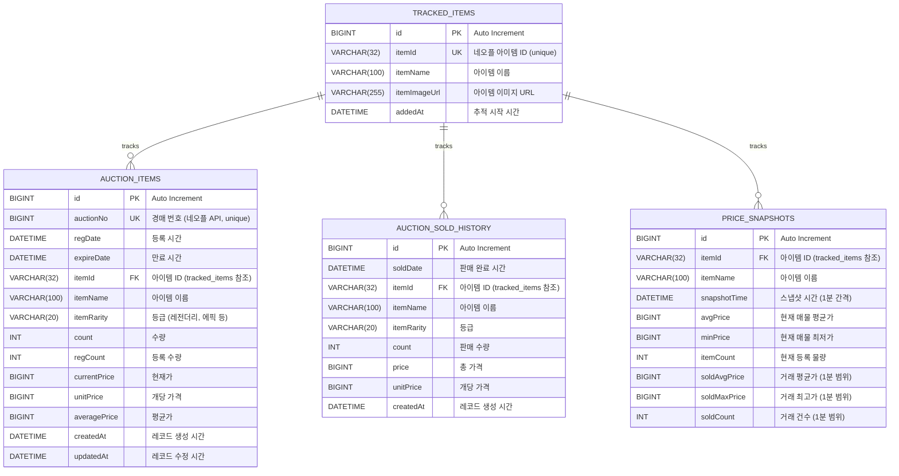
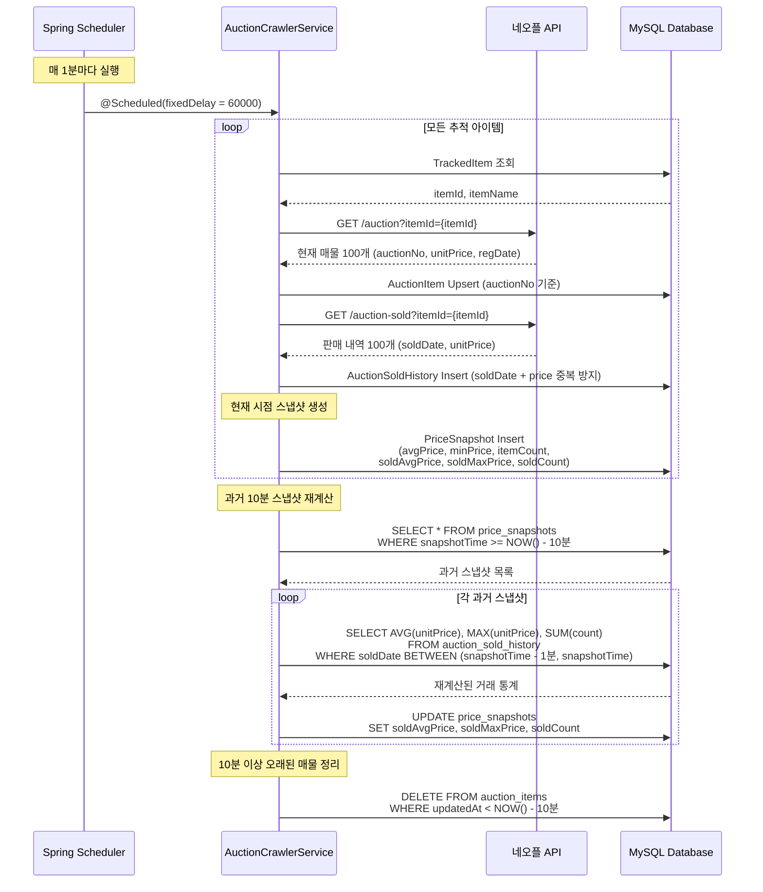

# JPA (MySQL) ER Diagram - 경매장 시세 추적 시스템

던파 인사이트 프로젝트의 MySQL JPA 엔티티 관계도 및 상세 스키마

---

## 📊 전체 ER Diagram (Mermaid)



---

## 🔗 테이블 간 관계 상세 설명

### 1️⃣ **tracked_items (추적 아이템 마스터 테이블)**

**역할**: 사용자가 시세를 추적하고 싶은 아이템 목록

**관계**:
- `1:N` → `auction_items` (하나의 추적 아이템은 여러 경매 매물을 가질 수 있음)
- `1:N` → `auction_sold_history` (하나의 추적 아이템은 여러 판매 내역을 가질 수 있음)
- `1:N` → `price_snapshots` (하나의 추적 아이템은 여러 시세 스냅샷을 가질 수 있음)

**연결 키**: `itemId` (VARCHAR(32), UNIQUE)
- 네오플 API의 아이템 고유 ID
- 다른 테이블의 Foreign Key로 사용 (논리적 FK, 물리적 FK 아님)

**JPA 매핑**:
```java
@Entity
@Table(name = "tracked_items")
public class TrackedItem {
    @Id
    @GeneratedValue(strategy = GenerationType.IDENTITY)
    private Long id;

    @Column(unique = true, nullable = false, length = 32)
    private String itemId;  // ⭐ 다른 테이블에서 참조

    @Column(nullable = false, length = 100)
    private String itemName;

    @Column(length = 255)
    private String itemImageUrl;

    @Column(nullable = false, updatable = false)
    private LocalDateTime addedAt;
}
```

**중요**: JPA에서 `@OneToMany` / `@ManyToOne` 관계 매핑이 **없음**
- 이유: `itemId` (String) 기반 조인으로 충분
- 성능: Lazy Loading 불필요, 명시적 쿼리로 제어
- 유연성: 네오플 API의 itemId만으로 데이터 연결 가능

---

### 2️⃣ **auction_items (현재 경매 매물)**

**역할**: 네오플 경매장 API에서 크롤링한 현재 판매 중인 매물

**관계**:
- `N:1` → `tracked_items` (여러 매물이 하나의 추적 아이템에 속함)

**연결 키**:
- **논리적 FK**: `itemId` (VARCHAR(32)) → `tracked_items.itemId` 참조
- **Unique Key**: `auctionNo` (BIGINT) - 네오플 경매 번호

**JPA 매핑**:
```java
@Entity
@Table(name = "auction_items",
       indexes = {
           @Index(name = "idx_item_id", columnList = "itemId"),      // 조회 성능
           @Index(name = "idx_unit_price", columnList = "unitPrice"), // 가격 정렬
           @Index(name = "idx_reg_date", columnList = "regDate")      // 시간 필터
       })
public class AuctionItem {
    @Id
    @GeneratedValue(strategy = GenerationType.IDENTITY)
    private Long id;

    @Column(unique = true, nullable = false)
    private Long auctionNo;  // ⭐ 네오플 경매 번호 (중복 방지)

    @Column(nullable = false, columnDefinition = "DATETIME")
    private LocalDateTime regDate;      // 등록 시간

    @Column(nullable = false, columnDefinition = "DATETIME")
    private LocalDateTime expireDate;   // 만료 시간

    @Column(nullable = false, length = 32)
    private String itemId;  // ⭐ tracked_items.itemId 참조

    @Column(nullable = false)
    private Integer count;        // 수량

    private Long unitPrice;       // 개당 가격 (중요!)
    private Long currentPrice;    // 현재가
    private Long averagePrice;    // 평균가
}
```

**데이터 흐름**:
1. 크롤러가 1분 20초마다 네오플 API 호출
2. `tracked_items`의 모든 `itemId`에 대해 경매 매물 조회
3. `auctionNo` 기준 Upsert (중복 방지)
4. 10분 이상 API 응답 없으면 판매 완료로 간주 → `auction_sold_history` 이동

**인덱스 전략**:
- `idx_item_id`: 아이템별 매물 조회 (가장 빈번)
- `idx_unit_price`: 가격 정렬 (차트용)
- `idx_reg_date`: 시간 범위 필터 (최근 매물 조회)

---

### 3️⃣ **auction_sold_history (판매 완료 내역)**

**역할**: 실제 거래가 완료된 판매 내역 (과거 데이터)

**관계**:
- `N:1` → `tracked_items` (여러 판매 내역이 하나의 추적 아이템에 속함)

**연결 키**:
- **논리적 FK**: `itemId` (VARCHAR(32)) → `tracked_items.itemId` 참조

**JPA 매핑**:
```java
@Entity
@Table(name = "auction_sold_history",
       indexes = {
           @Index(name = "idx_item_id", columnList = "itemId"),
           @Index(name = "idx_sold_date", columnList = "soldDate"),
           @Index(name = "idx_item_sold", columnList = "itemId, soldDate")  // 복합 인덱스
       })
public class AuctionSoldHistory {
    @Id
    @GeneratedValue(strategy = GenerationType.IDENTITY)
    private Long id;

    @Column(nullable = false, columnDefinition = "DATETIME")
    private LocalDateTime soldDate;  // ⭐ 판매 시간 (네오플 API 제공)

    @Column(nullable = false, length = 32)
    private String itemId;  // ⭐ tracked_items.itemId 참조

    @Column(nullable = false)
    private Integer count;      // 판매 수량

    @Column(nullable = false)
    private Long price;         // 총 가격

    @Column(nullable = false)
    private Long unitPrice;     // 개당 가격 (중요!)
}
```

**데이터 흐름**:
1. 네오플 API가 최근 100건 판매 내역 반환
2. `soldDate` + `itemId` + `price` 조합으로 중복 방지
3. 과거 판매 내역이 뒤늦게 수집되면 과거 스냅샷 재계산

**중요**: 판매 시간 (`soldDate`)은 **과거 시간**
- 예: 09:30 크롤링 시 09:20~09:27 판매 내역 수집 가능
- 따라서 과거 10분치 스냅샷을 재계산해야 정확한 거래량 반영

**커스텀 쿼리 (Repository)**:
```java
// 특정 기간 평균 판매가
@Query("SELECT AVG(a.unitPrice) FROM AuctionSoldHistory a " +
       "WHERE a.itemId = :itemId " +
       "AND a.soldDate BETWEEN :startTime AND :endTime")
Double getAveragePriceBetween(@Param("itemId") String itemId,
                               @Param("startTime") LocalDateTime startTime,
                               @Param("endTime") LocalDateTime endTime);

// 특정 기간 거래량
@Query("SELECT COALESCE(SUM(a.count), 0) FROM AuctionSoldHistory a " +
       "WHERE a.itemId = :itemId " +
       "AND a.soldDate BETWEEN :startTime AND :endTime")
Long sumSoldCountBetween(@Param("itemId") String itemId,
                          @Param("startTime") LocalDateTime startTime,
                          @Param("endTime") LocalDateTime endTime);
```

---

### 4️⃣ **price_snapshots (시세 스냅샷)**

**역할**: 1분마다 자동 생성되는 시세 스냅샷 (시계열 데이터)

**관계**:
- `N:1` → `tracked_items` (여러 스냅샷이 하나의 추적 아이템에 속함)

**연결 키**:
- **논리적 FK**: `itemId` (VARCHAR(32)) → `tracked_items.itemId` 참조
- **Unique Constraint**: `(itemId, snapshotTime)` 조합 유일

**JPA 매핑**:
```java
@Entity
@Table(name = "price_snapshots",
       uniqueConstraints = {
           @UniqueConstraint(name = "uk_item_snapshot",
                             columnNames = {"itemId", "snapshotTime"})  // ⭐ 중복 방지
       },
       indexes = {
           @Index(name = "idx_item_time", columnList = "itemId, snapshotTime"),
           @Index(name = "idx_snapshot_time", columnList = "snapshotTime")
       })
public class PriceSnapshot {
    @Id
    @GeneratedValue(strategy = GenerationType.IDENTITY)
    private Long id;

    @Column(nullable = false, length = 32)
    private String itemId;  // ⭐ tracked_items.itemId 참조

    @Column(nullable = false, columnDefinition = "DATETIME")
    private LocalDateTime snapshotTime;  // ⭐ 스냅샷 시간

    // 현재 매물 통계 (auction_items 기반)
    private Long avgPrice;      // 평균가 (가중평균)
    private Long minPrice;      // 최저가
    private Integer itemCount;  // 등록 물량

    // 거래 통계 (auction_sold_history 기반, 1분 범위)
    private Long soldAvgPrice;  // 거래 평균가
    private Long soldMaxPrice;  // 거래 최고가
    private Integer soldCount;  // 거래 건수
}
```

**데이터 생성 로직** (`AuctionCrawlerService.java`):

```java
@Scheduled(fixedDelay = 60000, initialDelay = 10000)  // ⭐ 1분마다 실행
public void crawlTrackedItems() {
    LocalDateTime now = LocalDateTime.now();

    // 1. 현재 시점 스냅샷 생성
    for (TrackedItem tracked : trackedItems) {
        PriceSnapshot snapshot = PriceSnapshot.builder()
            .itemId(tracked.getItemId())
            .snapshotTime(now)
            .avgPrice(calculateAvgPrice(tracked.getItemId()))  // auction_items 기반
            .minPrice(calculateMinPrice(tracked.getItemId()))
            .itemCount(countItems(tracked.getItemId()))
            .soldAvgPrice(calculateSoldAvg(tracked.getItemId(), now.minusMinutes(1), now))
            .soldMaxPrice(calculateSoldMax(tracked.getItemId(), now.minusMinutes(1), now))
            .soldCount(countSold(tracked.getItemId(), now.minusMinutes(1), now))
            .build();

        priceSnapshotRepo.save(snapshot);
    }

    // 2. 과거 10분치 스냅샷 재계산 (뒤늦게 수집된 판매 내역 반영)
    recalculatePastSnapshots(trackedItems);
}

private void recalculatePastSnapshots(List<TrackedItem> trackedItems) {
    LocalDateTime now = LocalDateTime.now();
    LocalDateTime tenMinutesAgo = now.minusMinutes(10);

    for (TrackedItem tracked : trackedItems) {
        // 과거 10분치 스냅샷 조회
        List<PriceSnapshot> pastSnapshots = priceSnapshotRepo
            .findByItemIdAndSnapshotTimeBetween(tracked.getItemId(), tenMinutesAgo, now);

        // 각 스냅샷마다 soldDate 기준으로 거래 통계 재계산
        for (PriceSnapshot snapshot : pastSnapshots) {
            LocalDateTime snapshotTime = snapshot.getSnapshotTime();
            LocalDateTime intervalStart = snapshotTime.minusMinutes(1);  // ⭐ 1분 범위

            Double soldAvgPrice = soldHistoryRepo.getAveragePriceBetween(
                tracked.getItemId(), intervalStart, snapshotTime
            );
            Long soldMaxPrice = soldHistoryRepo.getMaxPriceBetween(
                tracked.getItemId(), intervalStart, snapshotTime
            );
            Long soldCount = soldHistoryRepo.sumSoldCountBetween(
                tracked.getItemId(), intervalStart, snapshotTime
            );

            // 변경된 값만 업데이트
            boolean changed = false;
            if (soldAvgPrice != null && !soldAvgPrice.equals(snapshot.getSoldAvgPrice())) {
                snapshot.setSoldAvgPrice(soldAvgPrice.longValue());
                changed = true;
            }
            if (soldMaxPrice != null && !soldMaxPrice.equals(snapshot.getSoldMaxPrice())) {
                snapshot.setSoldMaxPrice(soldMaxPrice);
                changed = true;
            }
            if (soldCount != null && !soldCount.equals(snapshot.getSoldCount())) {
                snapshot.setSoldCount(soldCount.intValue());
                changed = true;
            }

            if (changed) {
                priceSnapshotRepo.save(snapshot);
            }
        }
    }
}
```

**재계산이 필요한 이유**:
- 네오플 API는 **최근 100건** 판매 내역 반환
- 판매 시간(`soldDate`)은 **과거 시간** (예: 10분 전)
- 초기 스냅샷 생성 시 1분 범위로 계산하면 거래량 0일 수 있음
- 다음 크롤링에서 과거 판매 내역이 수집되면 **과거 스냅샷을 재계산**하여 정확도 향상

**예시 타임라인**:
```
09:29:00 - 스냅샷 생성 (soldDate 범위: 09:28:00~09:29:00) → soldCount=0
09:30:00 - 네오플 API 호출 → soldDate 09:20~09:27 판매 내역 100건 수집
09:30:00 - 09:29:00 스냅샷 재계산 → soldCount 업데이트
```

**인덱스 전략**:
- `uk_item_snapshot`: `(itemId, snapshotTime)` 유일성 보장 (중복 방지)
- `idx_item_time`: 아이템별 시계열 조회 (차트용)
- `idx_snapshot_time`: 시간 범위 필터 (최근 N시간 조회)

**커스텀 쿼리 (Repository)**:
```java
// 최근 7일 시세 추이 (차트용)
@Query("SELECT s FROM PriceSnapshot s " +
       "WHERE s.itemId = :itemId " +
       "AND s.snapshotTime >= :since " +
       "ORDER BY s.snapshotTime ASC")
List<PriceSnapshot> findPriceHistory(@Param("itemId") String itemId,
                                     @Param("since") LocalDateTime since);

// 최신 스냅샷
@Query("SELECT s FROM PriceSnapshot s " +
       "WHERE s.itemId = :itemId " +
       "ORDER BY s.snapshotTime DESC " +
       "LIMIT 1")
PriceSnapshot findLatestByItemId(@Param("itemId") String itemId);

// 재계산용 (특정 기간 스냅샷 조회)
List<PriceSnapshot> findByItemIdAndSnapshotTimeBetween(
    String itemId,
    LocalDateTime start,
    LocalDateTime end
);
```

---

## 🔄 데이터 흐름 시퀀스 다이어그램



---

## 📈 실제 사용 예시 (Controller → Service → Repository)

### 예시 1: 특정 아이템의 최근 7일 시세 차트

**Controller:**
```java
@GetMapping("/items/{itemId}/snapshots")
public List<PriceSnapshotResponse> getPriceSnapshots(
    @PathVariable String itemId,
    @RequestParam(defaultValue = "60") int intervalMinutes
) {
    return auctionService.getPriceSnapshots(itemId, intervalMinutes);
}
```

**Service:**
```java
public List<PriceSnapshotResponse> getPriceSnapshots(String itemId, int intervalMinutes) {
    LocalDateTime since = LocalDateTime.now().minusMinutes(intervalMinutes);

    // 1. PriceSnapshot 조회 (인덱스 활용)
    List<PriceSnapshot> snapshots = priceSnapshotRepo
        .findByItemIdAndSnapshotTimeAfterOrderBySnapshotTimeAsc(itemId, since);

    // 2. DTO 변환
    return snapshots.stream()
        .map(s -> PriceSnapshotResponse.builder()
            .timestamp(s.getSnapshotTime())
            .avgPrice(s.getAvgPrice())
            .minPrice(s.getMinPrice())
            .itemCount(s.getItemCount())
            .soldAvgPrice(s.getSoldAvgPrice())
            .soldMaxPrice(s.getSoldMaxPrice())
            .soldCount(s.getSoldCount())
            .build())
        .collect(Collectors.toList());
}
```

**실행 SQL:**
```sql
SELECT * FROM price_snapshots
WHERE itemId = '36beb5ca88540128e075aa5a647d2e1b'
  AND snapshotTime >= '2025-01-13 10:00:00'
ORDER BY snapshotTime ASC;

-- 인덱스 사용: idx_item_time (itemId, snapshotTime)
```

---

### 예시 2: 특정 아이템의 현재 최저가 매물 조회

**Controller:**
```java
@GetMapping("/items/{itemId}/current")
public List<AuctionItemResponse> getCurrentAuctions(@PathVariable String itemId) {
    return auctionService.getCurrentAuctions(itemId);
}
```

**Service:**
```java
public List<AuctionItemResponse> getCurrentAuctions(String itemId) {
    // 1. AuctionItem 조회 (itemId + unitPrice 정렬)
    List<AuctionItem> items = auctionItemRepo.findByItemIdOrderByUnitPriceAsc(itemId);

    // 2. DTO 변환
    return items.stream()
        .map(item -> AuctionItemResponse.builder()
            .auctionNo(item.getAuctionNo())
            .unitPrice(item.getUnitPrice())
            .count(item.getCount())
            .regDate(item.getRegDate())
            .expireDate(item.getExpireDate())
            .build())
        .collect(Collectors.toList());
}
```

**실행 SQL:**
```sql
SELECT * FROM auction_items
WHERE itemId = '36beb5ca88540128e075aa5a647d2e1b'
ORDER BY unitPrice ASC;

-- 인덱스 사용: idx_item_id + idx_unit_price
```

---

### 예시 3: 특정 아이템의 최근 24시간 거래 통계

**Service:**
```java
public SoldStatistics getSoldStatistics(String itemId, int hours) {
    LocalDateTime since = LocalDateTime.now().minusHours(hours);

    // 1. 평균 판매가
    Double avgPrice = soldHistoryRepo.getAveragePriceSince(itemId, since);

    // 2. 최저/최고 판매가
    Long minPrice = soldHistoryRepo.getMinPriceSince(itemId, since);
    Long maxPrice = soldHistoryRepo.getMaxPriceSince(itemId, since);

    // 3. 거래량
    Long soldCount = soldHistoryRepo.countSoldSince(itemId, since);

    return SoldStatistics.builder()
        .avgPrice(avgPrice != null ? avgPrice.longValue() : 0L)
        .minPrice(minPrice != null ? minPrice : 0L)
        .maxPrice(maxPrice != null ? maxPrice : 0L)
        .soldCount(soldCount != null ? soldCount : 0L)
        .build();
}
```

**실행 SQL:**
```sql
-- 평균 판매가
SELECT AVG(unitPrice) FROM auction_sold_history
WHERE itemId = '36beb5ca88540128e075aa5a647d2e1b'
  AND soldDate >= '2025-01-12 10:00:00';

-- 최고 판매가
SELECT MAX(unitPrice) FROM auction_sold_history
WHERE itemId = '36beb5ca88540128e075aa5a647d2e1b'
  AND soldDate >= '2025-01-12 10:00:00';

-- 거래량
SELECT COUNT(*) FROM auction_sold_history
WHERE itemId = '36beb5ca88540128e075aa5a647d2e1b'
  AND soldDate >= '2025-01-12 10:00:00';

-- 인덱스 사용: idx_item_sold (itemId, soldDate)
```

---

## 🎯 인덱스 전략 요약

### tracked_items
| 인덱스명 | 컬럼 | 타입 | 용도 |
|---------|------|------|------|
| PRIMARY | id | PK | 기본 키 |
| uk_item_id | itemId | UNIQUE | 아이템 ID 중복 방지 |

### auction_items
| 인덱스명 | 컬럼 | 타입 | 용도 |
|---------|------|------|------|
| PRIMARY | id | PK | 기본 키 |
| uk_auction_no | auctionNo | UNIQUE | 경매 번호 중복 방지 |
| idx_item_id | itemId | INDEX | 아이템별 매물 조회 (가장 빈번) |
| idx_unit_price | unitPrice | INDEX | 가격 정렬 (차트용) |
| idx_reg_date | regDate | INDEX | 시간 범위 필터 |

### auction_sold_history
| 인덱스명 | 컬럼 | 타입 | 용도 |
|---------|------|------|------|
| PRIMARY | id | PK | 기본 키 |
| idx_item_id | itemId | INDEX | 아이템별 판매 내역 조회 |
| idx_sold_date | soldDate | INDEX | 시간 범위 필터 |
| idx_item_sold | itemId, soldDate | COMPOSITE | 아이템별 시계열 조회 (최적화) |

### price_snapshots
| 인덱스명 | 컬럼 | 타입 | 용도 |
|---------|------|------|------|
| PRIMARY | id | PK | 기본 키 |
| uk_item_snapshot | itemId, snapshotTime | UNIQUE | 중복 방지 (같은 시간 스냅샷 1개만) |
| idx_item_time | itemId, snapshotTime | COMPOSITE | 아이템별 시계열 조회 (차트용) |
| idx_snapshot_time | snapshotTime | INDEX | 시간 범위 필터 (전체 스냅샷 조회) |

---

## ⚙️ JPA 설정 (application.yml)

```yaml
spring:
  datasource:
    url: jdbc:mysql://mysql:3306/dnf_auction?useSSL=false&serverTimezone=Asia/Seoul&characterEncoding=UTF-8
    username: dnf
    password: password123
    driver-class-name: com.mysql.cj.jdbc.Driver

  jpa:
    hibernate:
      ddl-auto: update  # 개발: update, 프로덕션: validate
    properties:
      hibernate:
        dialect: org.hibernate.dialect.MySQL8Dialect
        format_sql: true
        show_sql: true
        jdbc:
          time_zone: Asia/Seoul  # ⭐ 중요! Timezone 설정
    show-sql: true

logging:
  level:
    org.hibernate.SQL: DEBUG
    org.hibernate.type.descriptor.sql.BasicBinder: TRACE
```

---

## 🚨 중요 설계 결정 사항

### 1. **물리적 Foreign Key 미사용**
```java
// ❌ 사용 안함
@ManyToOne
@JoinColumn(name = "itemId", referencedColumnName = "itemId")
private TrackedItem trackedItem;

// ✅ 사용함 (String 기반 논리적 FK)
@Column(nullable = false, length = 32)
private String itemId;
```

**이유**:
- 네오플 API의 `itemId` (String)로 충분히 연결 가능
- `@ManyToOne` 사용 시 Lazy Loading 복잡도 증가
- Cascade 삭제 불필요 (추적 아이템 삭제해도 과거 데이터 유지)
- 성능: String 기반 조인이 더 빠름 (인덱스 활용)

### 2. **Timezone 명시 (Asia/Seoul)**
```yaml
hibernate.jdbc.time_zone: Asia/Seoul
```

**중요성**:
- `LocalDateTime`은 timezone 정보 없음
- 네오플 API는 KST 시간 제공 (예: "2025-01-13 18:30:00")
- Hibernate 기본값(UTC)으로 저장하면 9시간 차이 발생
- 해결: JPA에 timezone 명시하여 KST 그대로 저장

### 3. **Unique Constraint vs Index**

**Unique Constraint:**
- `tracked_items.itemId`: 아이템 ID 중복 방지
- `auction_items.auctionNo`: 경매 번호 중복 방지
- `price_snapshots.(itemId, snapshotTime)`: 같은 시간 스냅샷 1개만

**Index (Non-Unique):**
- `auction_items.itemId`: 조회 성능 (중복 허용)
- `auction_sold_history.(itemId, soldDate)`: 복합 인덱스로 시계열 조회 최적화

### 4. **자동 타임스탬프 (@PrePersist / @PreUpdate)**
```java
@PrePersist
protected void onCreate() {
    createdAt = LocalDateTime.now();
    updatedAt = LocalDateTime.now();
}

@PreUpdate
protected void onUpdate() {
    updatedAt = LocalDateTime.now();
}
```

**이점**:
- 수동 설정 불필요
- 생성/수정 시간 자동 기록
- 디버깅 용이

---

## 📊 테이블 크기 예상 (1년 운영 기준)

### tracked_items
- 아이템 수: 100개
- 레코드 수: **100개**
- 용량: **< 1MB**

### auction_items
- 추적 아이템당 평균 매물: 50개
- 레코드 수: **5,000개** (100 × 50)
- 용량: **< 10MB**

### auction_sold_history
- 하루 거래량: 추적 아이템당 평균 20건
- 레코드 수: **730,000개** (100 × 20 × 365)
- 용량: **< 100MB**

### price_snapshots
- 스냅샷 주기: 1분 (1시간당 60개)
- 하루 스냅샷: 1,440개 (24시간 × 60)
- 레코드 수: **52,560,000개** (100 × 1,440 × 365)
- 용량: **< 3GB**

**총 용량**: **< 4GB** (1년 운영 기준)

**성능 최적화**:
- 6개월 이상 오래된 `price_snapshots` 주기적 삭제
- Partitioning: `snapshotTime` 기준 월별 파티션
- Archiving: 과거 데이터 별도 스토리지 이관

---

## 🔧 개선 가능 사항

### 1. **Read Replica 도입**
```yaml
# Master (Write)
spring.datasource.master.url=jdbc:mysql://mysql-master:3306/dnf_auction

# Slave (Read)
spring.datasource.slave.url=jdbc:mysql://mysql-slave:3306/dnf_auction
```

**이점**:
- 크롤링(Write)과 차트 조회(Read) 분리
- 읽기 성능 향상

### 2. **캐싱 전략 (Redis)**
```java
@Cacheable(value = "priceSnapshots", key = "#itemId + '_' + #minutes")
public List<PriceSnapshot> getPriceSnapshots(String itemId, int minutes) {
    // ...
}
```

**캐싱 대상**:
- 최근 1시간 스냅샷 (TTL: 1분)
- 인기 아이템 TOP 10 (TTL: 5분)

### 3. **배치 처리 (Spring Batch)**
```java
@Scheduled(cron = "0 0 3 * * ?")  // 매일 새벽 3시
public void deleteOldSnapshots() {
    LocalDateTime sixMonthsAgo = LocalDateTime.now().minusMonths(6);
    priceSnapshotRepo.deleteBySnapshotTimeBefore(sixMonthsAgo);
}
```

**배치 작업**:
- 오래된 스냅샷 삭제 (6개월 이상)
- 통계 집계 (주간/월간 거래 순위)

---

## 📝 결론

이 ER 다이어그램은 **던파 인사이트 경매장 시세 추적 시스템**의 MySQL JPA 구조를 상세히 설명합니다.

**핵심 특징**:
- ✅ String 기반 논리적 FK (물리적 FK 미사용)
- ✅ 시계열 데이터 최적화 (복합 인덱스, Unique Constraint)
- ✅ 자동 타임스탬프 (@PrePersist / @PreUpdate)
- ✅ Timezone 명시 (Asia/Seoul)
- ✅ 스냅샷 재계산 로직 (과거 데이터 보정)

**성능 고려사항**:
- 인덱스 전략: 조회 패턴에 최적화
- 복합 인덱스: `(itemId, soldDate)`, `(itemId, snapshotTime)`
- Unique Constraint: 중복 데이터 방지

**확장 가능성**:
- Read Replica 도입
- Redis 캐싱
- Partitioning (월별)
- Archiving (과거 데이터)

---

**문서 작성일**: 2025-01-13
**마지막 업데이트**: 2025-01-13
**버전**: 1.0.0
