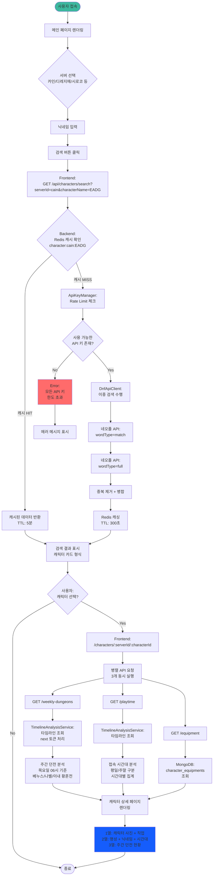
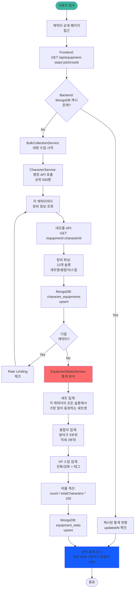
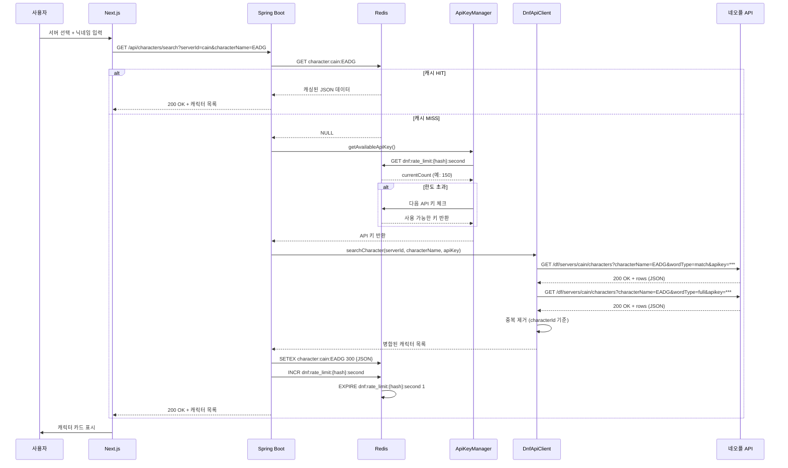
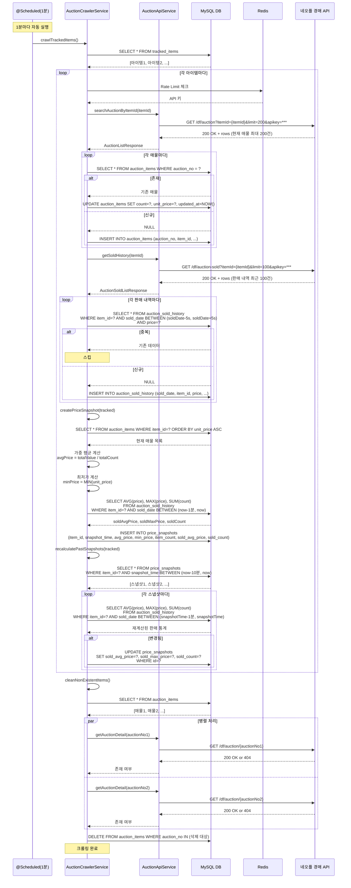
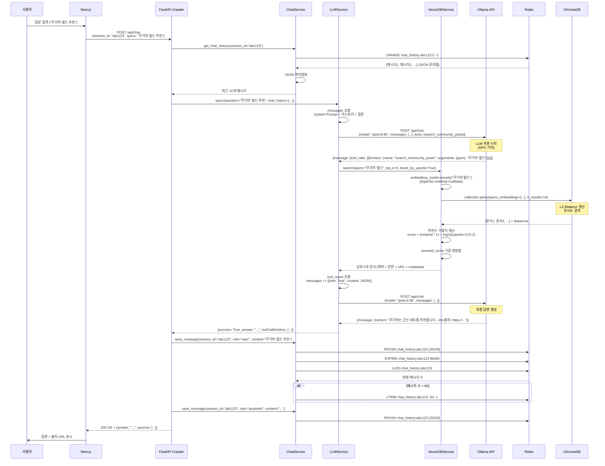
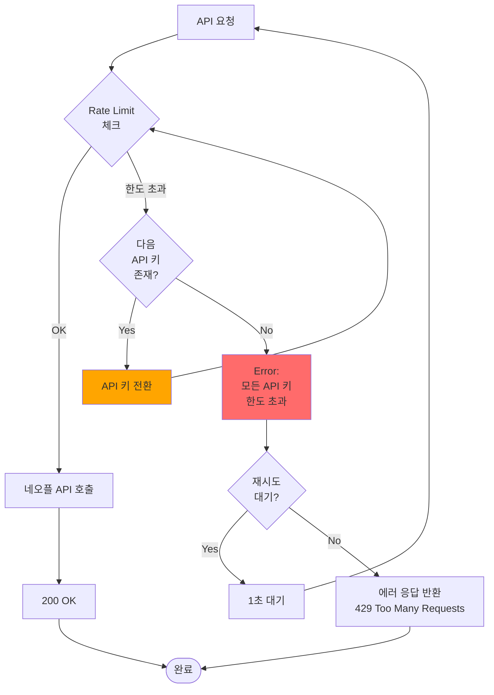
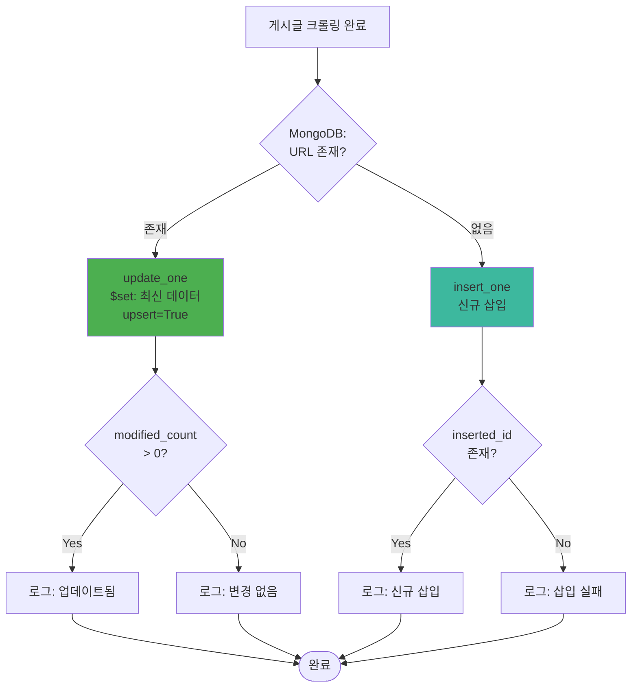
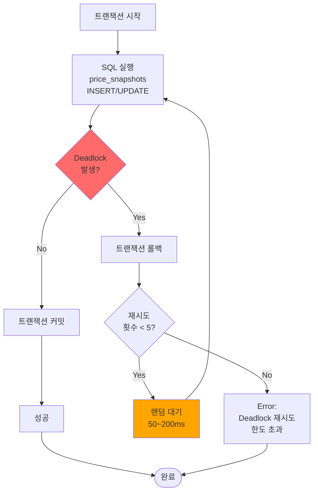

# 시스템 흐름도 (SYSTEM_FLOW.md)

## 목차
1. [사용자 시나리오별 플로우차트](#사용자-시나리오별-플로우차트)
2. [API 요청/응답 시퀀스 다이어그램](#api-요청응답-시퀀스-다이어그램)
3. [비동기 처리 흐름](#비동기-처리-흐름)
4. [에러 처리 및 재시도 전략](#에러-처리-및-재시도-전략)

---

## 사용자 시나리오별 플로우차트

### 1. 캐릭터 검색 → 상세 정보 조회 플로우



**주요 특징**:
- ✅ **이중 검색**: `wordType=match` + `wordType=full` → 정확도 향상
- ✅ **Redis 캐싱**: 5분 TTL → API 호출 최소화
- ✅ **병렬 요청**: 주간 던전, 접속 시간대, 장비 정보 동시 조회
- ✅ **Rate Limiting**: Redis Sliding Window 방식

---

### 2. 경매장 시세 조회 플로우

```mermaid
flowchart TD
    Start([사용자 접속]) --> AuctionPage[경매장 페이지 접근<br/>/auction]

    AuctionPage --> LoadItems[Frontend:<br/>GET /api/auction/items<br/>추적 아이템 목록 조회]

    LoadItems --> BackendQuery[Backend:<br/>TrackedItemRepository<br/>findAll()]

    BackendQuery --> DisplayList[아이템 목록 표시<br/>아코디언 형식<br/>접힌 상태]

    DisplayList --> UserExpand{사용자:<br/>아이템 펼치기?}

    UserExpand -->|No| End([종료])

    UserExpand -->|Yes| ReqSnapshots[Frontend:<br/>GET /api/auction/items/:itemId/snapshots?interval=30<br/>기본: 최근 30분]

    ReqSnapshots --> QuerySnapshots[Backend:<br/>PriceSnapshotRepository<br/>findByItemIdAndSnapshotTimeBetween]

    QuerySnapshots --> CheckData{스냅샷<br/>데이터 존재?}

    CheckData -->|No| DisplayEmpty[빈 차트 표시<br/>"데이터 수집 중..."]
    DisplayEmpty --> End

    CheckData -->|Yes| ReturnSnapshots[스냅샷 데이터 반환<br/>snapshotTime, avgPrice,<br/>itemCount, soldCount]

    ReturnSnapshots --> RenderChart[Recharts:<br/>ComposedChart 렌더링<br/>듀얼 Y축]

    RenderChart --> DisplayChart[왼쪽 Y축: 현재가 Line<br/>오른쪽 Y축: 등록 물량 Bar, 거래량 Bar]

    DisplayChart --> UserInteraction{사용자:<br/>마우스 휠<br/>스크롤?}

    UserInteraction -->|No| End

    UserInteraction -->|Yes| PreventScroll[이벤트 핸들러:<br/>e.preventDefault<br/>passive: false]

    PreventScroll --> AdjustInterval{휠 방향?}

    AdjustInterval -->|위로| IncreaseInterval[interval 증가<br/>2분→10분→30분→1시간→6시간→12시간→1일]
    AdjustInterval -->|아래로| DecreaseInterval[interval 감소<br/>1일→12시간→6시간→1시간→30분→10분→2분]

    IncreaseInterval --> ReqSnapshots
    DecreaseInterval --> ReqSnapshots

    style Start fill:#3DB89E
    style DisplayChart fill:#6C63FF
```

**주요 특징**:
- ✅ **마우스 휠 인터랙션**: 차트 위에서 휠 스크롤 시 시간 간격 조절
- ✅ **페이지 스크롤 방지**: `addEventListener('wheel', handler, {passive: false})`
- ✅ **듀얼 Y축**: 현재가(Line) + 등록 물량/거래량(Bar)
- ✅ **1원 단위 표시**: 개당 가격 정밀 표시

---

### 3. LLM 채팅 (RAG) 플로우

```mermaid
flowchart TD
    Start([사용자 질문 입력]) --> FrontendReq[Frontend:<br/>POST /api/chat<br/>{session_id, query}]

    FrontendReq --> GetHistory[ChatService:<br/>Redis LRANGE<br/>chat_history:session_id]

    GetHistory --> CheckHistory{채팅<br/>히스토리 존재?}

    CheckHistory -->|No| EmptyHistory[빈 히스토리]
    CheckHistory -->|Yes| LoadHistory[최근 10개 메시지<br/>로드]

    EmptyHistory --> CallLLM[LLMService:<br/>query 호출]
    LoadHistory --> CallLLM

    CallLLM --> PrepareMessages[System Prompt +<br/>채팅 히스토리 +<br/>사용자 질문<br/>조합]

    PrepareMessages --> OllamaReq[Ollama API:<br/>POST /api/chat<br/>model: qwen3:4b<br/>tools: search_community_posts]

    OllamaReq --> OllamaResp{Ollama<br/>응답 타입?}

    OllamaResp -->|tool_calls| ExecuteTool[DnfApiTools:<br/>search_community_posts 실행]

    ExecuteTool --> VectorSearch[VectorDBService:<br/>ChromaDB 검색]

    VectorSearch --> Embedding[Ko-Sroberta:<br/>쿼리 임베딩<br/>768차원 벡터]

    Embedding --> ChromaQuery[ChromaDB:<br/>collection.query<br/>n_results=10]

    ChromaQuery --> CalcBoost[추천수 가중치 계산<br/>score = similarity *<br/>1 + log10 upvote+1 *0.2]

    CalcBoost --> SortResults[boosted_score 기준<br/>재정렬<br/>상위 5개 선택]

    SortResults --> ReturnDocs[검색 결과 반환<br/>제목 + 본문 + URL]

    ReturnDocs --> OllamaReq2[Ollama API:<br/>POST /api/chat<br/>messages + tool_result]

    OllamaReq2 --> OllamaResp

    OllamaResp -->|content| FinalAnswer[최종 답변 생성<br/>한국어<br/>출처 URL 포함]

    FinalAnswer --> SaveUserMsg[ChatService:<br/>Redis RPUSH<br/>user 메시지 저장]

    SaveUserMsg --> SaveAssistantMsg[ChatService:<br/>Redis RPUSH<br/>assistant 메시지 저장]

    SaveAssistantMsg --> SetTTL[Redis EXPIRE<br/>24시간 TTL]

    SetTTL --> CheckLimit{메시지 수<br/>> 50?}

    CheckLimit -->|Yes| TrimHistory[Redis LTRIM<br/>최근 50개만 유지]
    CheckLimit -->|No| ReturnAnswer[답변 반환]

    TrimHistory --> ReturnAnswer

    ReturnAnswer --> DisplayAnswer[Frontend:<br/>답변 + 출처 URL<br/>표시]

    DisplayAnswer --> End([종료])

    style Start fill:#3DB89E
    style DisplayAnswer fill:#6C63FF
    style VectorSearch fill:#FF6B6B
```

**주요 특징**:
- ✅ **Function Calling**: Ollama tool_calls로 필요 시 RAG 자동 수행
- ✅ **추천수 가중치**: 높은 추천수 → 높은 relevance (log10 스케일)
- ✅ **세션 관리**: Redis List로 최대 50개 메시지, 24시간 TTL
- ✅ **한국어 임베딩**: Ko-Sroberta (jhgan/ko-sroberta-multitask)

---

### 4. 크롤링 → 워드클라우드 생성 플로우

```mermaid
flowchart TD
    Start([스케줄러 시작]) --> CheckSchedule{Scheduler:<br/>1시간 간격?}

    CheckSchedule -->|No| Sleep[대기 중...]
    Sleep --> CheckSchedule

    CheckSchedule -->|Yes| StartCrawl[자동 크롤링 시작<br/>lifespan 이벤트]

    StartCrawl --> CrawlDC[DCInsideCrawler:<br/>dfip 갤러리<br/>Beautiful Soup]

    CrawlDC --> ReqDCPage[디시인사이드:<br/>GET /mgallery/board/lists/?id=dfip&page=N]

    ReqDCPage --> ParseDC[HTML 파싱<br/>게시글 리스트 추출]

    ParseDC --> FilterInfo{말머리<br/>📚정보?}

    FilterInfo -->|Yes| SaveInfo[MongoDB:<br/>info_posts<br/>upsert URL]
    FilterInfo -->|No| SaveComm[MongoDB:<br/>community_posts<br/>upsert URL]

    SaveInfo --> NextDCPage{다음<br/>페이지?}
    SaveComm --> NextDCPage

    NextDCPage -->|Yes| WaitDC[Rate Limiting:<br/>5초 대기]
    WaitDC --> ReqDCPage

    NextDCPage -->|No| CrawlArca[ArcaLiveCrawlerPlaywright:<br/>dunfa 채널<br/>Playwright]

    CrawlArca --> LaunchBrowser[Playwright:<br/>Chromium 브라우저 실행<br/>headless: True]

    LaunchBrowser --> ReqArcaPage[아카라이브:<br/>GET /b/dunfa?p=N]

    ReqArcaPage --> WaitLoad[page.wait_for_load_state<br/>"networkidle"]

    WaitLoad --> ExtractList[.list-area 영역<br/>선택적 크롤링]

    ExtractList --> LoopArticles[각 게시글마다<br/>본문 + 댓글 크롤링]

    LoopArticles --> ParseComments[댓글 계층 구조 파싱<br/>parent_id, depth, replies]

    ParseComments --> SaveArca[MongoDB:<br/>community_posts<br/>upsert URL]

    SaveArca --> NextArcaPage{다음<br/>페이지?}

    NextArcaPage -->|Yes| WaitArca[Rate Limiting:<br/>10초 대기<br/>Cloudflare 고려]
    WaitArca --> ReqArcaPage

    NextArcaPage -->|No| CloseBrowser[Playwright:<br/>브라우저 종료]

    CloseBrowser --> VectorEmbed[VectorDBService:<br/>info_posts 임베딩]

    VectorEmbed --> LoadInfoPosts[MongoDB:<br/>info_posts<br/>전체 조회]

    LoadInfoPosts --> BatchEmbed[SentenceTransformer:<br/>encode<br/>batch_size=32<br/>768차원 벡터]

    BatchEmbed --> UpsertChroma[ChromaDB:<br/>collection.upsert<br/>중복 방지]

    UpsertChroma --> WordCloudReq{워드클라우드<br/>생성 요청?}

    WordCloudReq -->|No| End([크롤링 완료])

    WordCloudReq -->|Yes| LoadPosts[MongoDB:<br/>community_posts<br/>최근 N개 조회]

    LoadPosts --> ExtractText[텍스트 전처리:<br/>제목 + 본문 + 댓글<br/>URL/이메일 제거]

    ExtractText --> Tokenize[KoNLPy Okt:<br/>명사 추출<br/>형태소 분석]

    Tokenize --> RemoveStopwords[불용어 제거:<br/>ㅋㅋㅋ, 조사 등]

    RemoveStopwords --> CountWords[단어 빈도 계산<br/>Top 100 추출]

    CountWords --> GenerateWC[WordCloud:<br/>이미지 생성<br/>나눔고딕 폰트]

    GenerateWC --> EncodeBase64[이미지 → Base64<br/>인코딩]

    EncodeBase64 --> SaveMongo[MongoDB:<br/>wordclouds<br/>insert]

    SaveMongo --> End

    style Start fill:#3DB89E
    style SaveMongo fill:#6C63FF
    style VectorEmbed fill:#FF6B6B
```

**주요 특징**:
- ✅ **자동 스케줄링**: 1시간 간격 크롤링 (설정 가능)
- ✅ **이중 크롤러**: 디시인사이드 (Beautiful Soup) + 아카라이브 (Playwright)
- ✅ **댓글 계층 구조**: parent_id, depth, replies로 트리 구조 저장
- ✅ **정보글 분리**: 📚정보 말머리 → info_posts → Vector DB
- ✅ **Rate Limiting**: 디시 5초, 아카 10초 간격
- ✅ **워드클라우드**: KoNLPy Okt + WordCloud + Base64 저장

---

### 5. 장비 통계 조회 플로우



**주요 특징**:
- ✅ **대량 수집**: 랭킹 API로 상위 500명 장비 수집
- ✅ **세트 판정**: 각 캐릭터의 모든 슬롯에서 가장 많이 등장하는 세트명
- ✅ **융합석 분류**: 방어구 5부위, 악세 3부위, 특수 융합석
- ✅ **VP 스킬**: 진화/강화 구분 + 세트/칭호/무기 튠 태그

---

## API 요청/응답 시퀀스 다이어그램

### 1. 캐릭터 검색 API



**API 스펙**:
- **요청**: `GET /api/characters/search?serverId={serverId}&characterName={characterName}`
- **응답**:
  ```json
  {
    "success": true,
    "characters": [
      {
        "serverId": "cain",
        "characterId": "cb87f16da8475750d45ac9ea60ccab39",
        "characterName": "EADG",
        "jobGrowId": "37495b941da3b1661bc900e68ef3b2c6",
        "jobGrowName": "眞 웨펀마스터",
        "fame": 72500
      }
    ]
  }
  ```

---

### 2. 경매장 자동 크롤링



**핵심 로직**:
1. **1분 간격 크롤링**: `@Scheduled(fixedDelay = 60000)`
2. **스냅샷 재계산**: 과거 10분치 스냅샷에 뒤늦게 수집된 판매 내역 반영
3. **병렬 매물 확인**: `CompletableFuture` 사용
4. **중복 체크**: `soldDate ±5초 + itemId + price` 조합

---

### 3. LLM 채팅 (RAG)



**API 스펙**:
- **요청**: `POST /api/chat`
  ```json
  {
    "session_id": "abc123",
    "query": "무기마 빌드 추천"
  }
  ```
- **응답**:
  ```json
  {
    "success": true,
    "answer": "무기마는 군신 세트를 추천합니다...\n\n출처: https://gall.dcinside.com/...",
    "toolCallsHistory": [
      {
        "function": "search_community_posts",
        "arguments": {"query": "무기마 빌드", "top_k": 5},
        "result": {"success": true, "results": [...]}
      }
    ],
    "iterations": 2
  }
  ```

---

## 비동기 처리 흐름

### 1. Spring Boot 스케줄러 (경매장 크롤링)

```mermaid
flowchart TB
    subgraph "Main Thread"
        AppStart[Spring Boot 시작] --> SchedulerInit[@EnableScheduling<br/>활성화]
        SchedulerInit --> ThreadPool[TaskScheduler<br/>ThreadPool 생성]
    end

    subgraph "Scheduler Thread Pool"
        ThreadPool --> Task1[@Scheduled<br/>fixedDelay=60000<br/>crawlTrackedItems]
        ThreadPool --> Task2[@Scheduled<br/>fixedDelay=600000<br/>cleanExpiredItems]

        Task1 --> Exec1[1분마다 실행<br/>경매장 크롤링]
        Task2 --> Exec2[10분마다 실행<br/>만료 매물 정리]

        Exec1 --> ParallelCheck{병렬 매물 확인?}
        ParallelCheck -->|Yes| CFuture1[CompletableFuture<br/>매물1 확인]
        ParallelCheck -->|Yes| CFuture2[CompletableFuture<br/>매물2 확인]

        CFuture1 --> Join[allOf.join<br/>모든 Future 완료 대기]
        CFuture2 --> Join

        Join --> Collect[삭제 대상 수집]
        Collect --> BatchDelete[일괄 삭제]

        Exec1 --> NextExec1[다음 실행 대기]
        Exec2 --> NextExec2[다음 실행 대기]
    end

    style Task1 fill:#FF6B6B
    style CFuture1 fill:#6C63FF
    style CFuture2 fill:#6C63FF
```

**코드 예시**:
```java
@Scheduled(fixedDelay = 60000, initialDelay = 10000)
@Transactional
public void crawlTrackedItems() {
    // 메인 크롤링 로직
}

// 병렬 처리
List<CompletableFuture<AuctionItem>> futures = allItems.stream()
    .map(item -> CompletableFuture.supplyAsync(() -> {
        return auctionApiService.getAuctionDetail(item.getAuctionNo());
    }))
    .collect(Collectors.toList());

CompletableFuture.allOf(futures.toArray(new CompletableFuture[0])).join();
```

---

### 2. FastAPI 비동기 크롤링

```mermaid
flowchart TB
    subgraph "FastAPI Lifespan"
        AppStart[FastAPI 시작] --> LifespanStart[lifespan 이벤트<br/>startup]
        LifespanStart --> CreateTask[asyncio.create_task<br/>background_crawler]

        CreateTask --> WhileTrue[while True 루프]
        WhileTrue --> Sleep1h[asyncio.sleep<br/>3600초 대기]

        Sleep1h --> CrawlDC[await dc_crawler.crawl_gallery<br/>디시인사이드]
        CrawlDC --> CrawlArca[await arca_crawler.crawl_board<br/>아카라이브]

        CrawlArca --> SaveMongo[await collection.update_one<br/>MongoDB upsert]
        SaveMongo --> VectorEmbed[await vector_db.add_posts<br/>임베딩 생성]

        VectorEmbed --> WhileTrue
    end

    subgraph "API Request Threads"
        UserReq[사용자 요청] --> APIRoute[FastAPI 라우트<br/>async def]
        APIRoute --> ParallelOps{병렬 작업?}

        ParallelOps -->|Yes| Gather1[asyncio.gather<br/>MongoDB 조회]
        ParallelOps -->|Yes| Gather2[asyncio.gather<br/>Ollama API 호출]

        Gather1 --> Response[JSON 응답 반환]
        Gather2 --> Response
    end

    style CrawlDC fill:#4CAF50
    style CrawlArca fill:#009688
    style VectorEmbed fill:#FF6B6B
```



**코드 예시**:
```python
@asynccontextmanager
async def lifespan(app: FastAPI):
    # Startup
    task = asyncio.create_task(background_crawler())
    yield
    # Shutdown
    task.cancel()

async def background_crawler():
    while True:
        await asyncio.sleep(3600)  # 1시간 대기
        posts = await dc_crawler.crawl_gallery()
        await save_to_mongo(posts)
        await vector_db.add_posts(posts)
```

---

### 3. Playwright 비동기 브라우저 자동화

```mermaid
flowchart TB
    Start[ArcaCrawler 시작] --> Launch[async with async_playwright]
    Launch --> Browser[await playwright.chromium.launch<br/>headless=True]

    Browser --> NewPage[await browser.new_page]
    NewPage --> Navigate[await page.goto<br/>https://arca.live/b/dunfa]

    Navigate --> WaitLoad[await page.wait_for_load_state<br/>"networkidle"]

    WaitLoad --> Extract[await page.query_selector_all<br/>.list-area .list-item]

    Extract --> LoopItems[for item in items<br/>비동기 순회]

    LoopItems --> ClickItem[await item.click]
    ClickItem --> WaitArticle[await page.wait_for_selector<br/>.article-body]

    WaitArticle --> GetContent[await element.inner_text<br/>본문 추출]
    GetContent --> GetComments[await page.query_selector_all<br/>.comment-item<br/>댓글 추출]

    GetComments --> ParseHierarchy[계층 구조 파싱<br/>parent_id, depth]

    ParseHierarchy --> SavePost[CommunityPost 생성]

    SavePost --> NextItem{다음<br/>게시글?}

    NextItem -->|Yes| RateLimit[await asyncio.sleep<br/>10초 대기]
    RateLimit --> LoopItems

    NextItem -->|No| ClosePage[await page.close]
    ClosePage --> CloseBrowser[await browser.close]

    CloseBrowser --> End([크롤링 완료])

    style Browser fill:#009688
    style ParseHierarchy fill:#FF6B6B
```

**코드 예시**:
```python
async with async_playwright() as p:
    browser = await p.chromium.launch(headless=True)
    page = await browser.new_page()

    await page.goto("https://arca.live/b/dunfa")
    await page.wait_for_load_state("networkidle")

    items = await page.query_selector_all(".list-item")
    for item in items:
        await item.click()
        await page.wait_for_selector(".article-body")
        content = await page.inner_text(".article-body")
        # ...

    await browser.close()
```

---

## 에러 처리 및 재시도 전략

### 1. API 키 한도 초과 처리



**구현**:
```java
public String getAvailableApiKey() {
    for (String apiKey : apiKeys) {
        if (checkRateLimit(apiKey)) {
            return apiKey;
        }
    }
    log.warn("⚠️ All API keys exceeded rate limit");
    return null;
}
```

---

### 2. MongoDB Upsert 중복 방지



**구현**:
```python
result = await collection.update_one(
    {"url": post.url},  # 필터: URL 기준
    {"$set": post.dict()},  # 업데이트 데이터
    upsert=True  # 없으면 삽입
)

if result.modified_count > 0:
    print(f"✅ 업데이트: {post.title}")
elif result.upserted_id:
    print(f"✅ 신규 삽입: {post.title}")
```

---

### 3. Ollama LLM 타임아웃 처리

```mermaid
flowchart TD
    Start[LLM 요청] --> SetTimeout[httpx.Timeout<br/>120초 설정]

    SetTimeout --> CallOllama[POST /api/chat]

    CallOllama --> CheckResponse{응답<br/>도착?}

    CheckResponse -->|120초 내| ParseResp[응답 파싱]
    CheckResponse -->|타임아웃| Retry{재시도<br/>횟수 < 3?}

    Retry -->|Yes| RetryCount[재시도 카운트++<br/>10초 대기]
    RetryCount --> CallOllama

    Retry -->|No| ErrorTimeout[Error:<br/>LLM 타임아웃]

    ParseResp --> CheckError{HTTP<br/>에러?}

    CheckError -->|Yes| ErrorHTTP[Error:<br/>400/500 에러]
    CheckError -->|No| Success[정상 응답]

    ErrorTimeout --> ReturnFallback[Fallback 응답:<br/>"죄송합니다. 시간 초과..."]
    ErrorHTTP --> ReturnFallback

    Success --> End([완료])
    ReturnFallback --> End

    style ErrorTimeout fill:#FF6B6B
    style ReturnFallback fill:#FFA500
```

**구현**:
```python
timeout = httpx.Timeout(120.0, connect=10.0)

try:
    async with httpx.AsyncClient(timeout=timeout) as client:
        response = await client.post(url, json=payload)
        response.raise_for_status()
        return response.json()
except httpx.TimeoutException:
    return {"content": "죄송합니다. 응답 시간이 초과되었습니다.", "tool_calls": []}
except httpx.HTTPStatusError as e:
    return {"content": f"LLM API 오류: {e.response.status_code}", "tool_calls": []}
```

---

### 4. MySQL Deadlock 재시도



**구현**:
```java
@Transactional
public void createPriceSnapshot(TrackedItem tracked) {
    int retries = 0;
    while (retries < 5) {
        try {
            PriceSnapshot snapshot = new PriceSnapshot();
            // ...
            priceSnapshotRepo.save(snapshot);
            break;
        } catch (DataAccessException e) {
            if (e.getMessage().contains("Deadlock") && retries < 4) {
                retries++;
                Thread.sleep((long) (50 + Math.random() * 150));
            } else {
                throw e;
            }
        }
    }
}
```

---

**작성일**: 2025-12-15
**버전**: 1.0.0
**작성자**: Claude Code (Sonnet 4.5)
